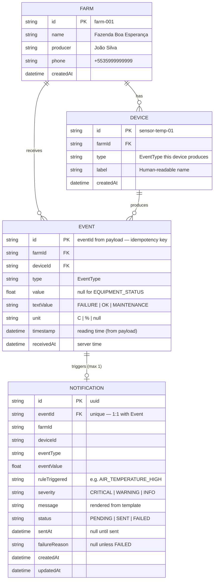

# Architecture — Data Model

## Entity-Relationship Diagram

## Design Decisions

| Decision | Rationale |
|---|---|
| `Event.id` = payload `eventId` | The natural idempotency key — re-delivery hits the primary key (see [business-rules.md §7](../business/business-rules.md#7-idempotency)) |
| `Notification.eventId` is `@unique` | Enforces "one event → at most one notification" at the database level |
| `value` + `textValue` on Event | Sensor events carry a number; `EQUIPMENT_STATUS` carries a string. One column would break typing. |
| Denormalized fields on Notification (`eventType`, `eventValue`, `farmId`, `deviceId`) | Notifications are immutable historical records — they must read standalone even if display needs no join |
| SQLite | Embedded, zero-config, sufficient for MVP volume |

## Indexes

| Table | Index | Purpose |
|---|---|---|
| `Event` | `farmId`, `deviceId`, `type` | Filtered history queries |
| `Notification` | `farmId`, `status`, `createdAt` | Dashboard lists + status filters |
| `Notification` | `eventId` (unique) | Cardinality guarantee |

## Seed Data

Seeded on `prisma db seed` (see `prisma/seed.ts`):

- **Farm**: `farm-001` — Fazenda Boa Esperança, João Silva, `+5535999999999`
- **Devices** (minimum):

| Device ID | Type | Label |
|---|---|---|
| `sensor-temp-01` | `AIR_TEMPERATURE` | Ambient temperature sensor |
| `sensor-humidity-01` | `AIR_HUMIDITY` | Air humidity sensor |
| `sensor-soil-01` | `SOIL_MOISTURE` | Soil moisture sensor |
| `reservoir-sensor-01` | `WATER_RESERVOIR_LEVEL` | Water reservoir level sensor |
| `silo-sensor-01` | `SILO_LEVEL` | Silo level sensor |
| `irrigation-pump-01` | `EQUIPMENT_STATUS` | Irrigation pump |

- **Demo events**: the 7 events from `Instructions.md` §13 (6 alerts + 1 normal) — optionally loaded for demos.
