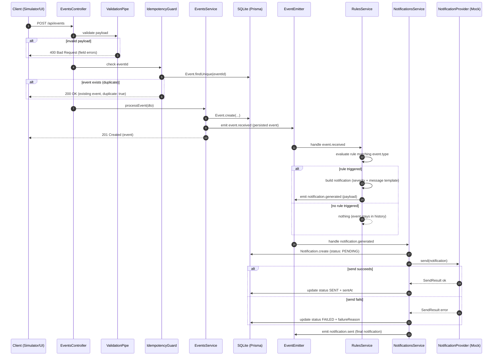
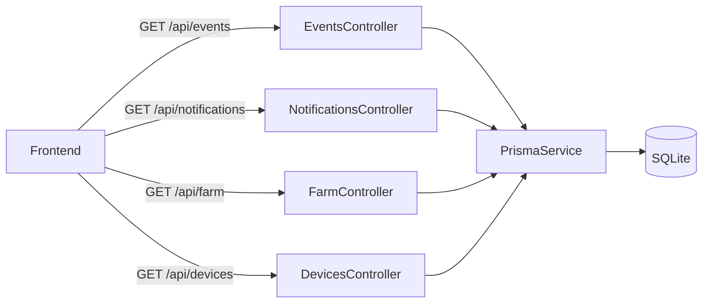

# Architecture — Event Pipeline

The core flow of the system: from a sensor reading to a delivered notification.

## Sequence Diagram

## Internal Events

| Event | Emitter → Consumer | Payload | Purpose |
|---|---|---|---|
| `event.received` | `EventsService` → `RulesService` | Persisted `Event` | Decouples ingestion from rule evaluation |
| `notification.generated` | `RulesService` → `NotificationsService` | Notification payload (rule, severity, message, event snapshot) | Decouples rule evaluation from notification lifecycle |
| `notification.sent` | `NotificationsService` → (observability) | Final `Notification` | Hook for future integrations (logs, metrics) |

## Error Paths

| Failure | Behavior |
|---|---|
| Invalid payload | `400` with per-field errors; nothing persisted |
| Duplicate `eventId` | `200` with existing event + `duplicate: true`; no reprocessing |
| Unknown farm/device | `400`; nothing persisted |
| Rule evaluation throws | Event remains persisted; error logged; pipeline must not crash the request (the `201` was already returned) |
| Provider send fails | Notification persisted as `FAILED` + `failureReason`; event unaffected |

## Synchronous vs Asynchronous

- Steps 1–6 (request handling through `201 Created`) are **synchronous** — the client gets confirmation that the event was accepted.
- Rule evaluation and notification delivery happen **in-process via the event emitter**, immediately after persistence (same request lifecycle in the MVP). The emitter indirection keeps modules decoupled so an out-of-process queue could replace it later without changing module contracts.

## Query Flow (read side)

