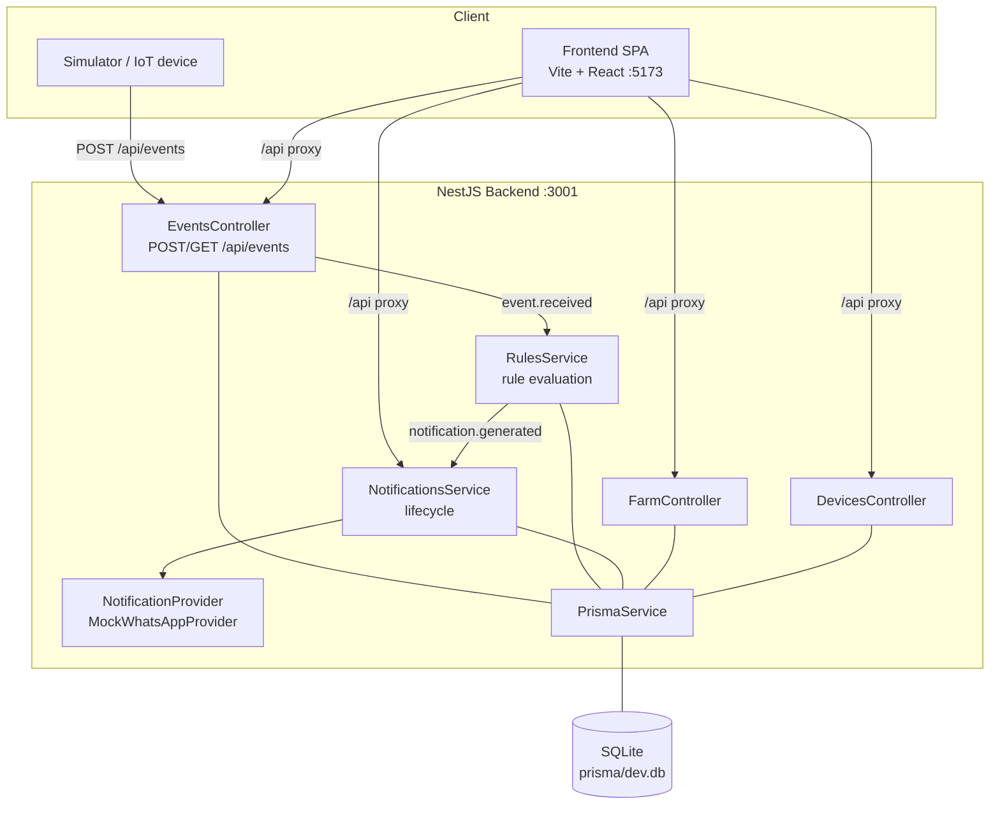

# Architecture — Overview

## Tech Stack

| Layer | Technology | Version |
|---|---|---|
| Backend | NestJS | ^11.x |
| Frontend | React + Vite | ^19.x / ^6.x |
| Language | TypeScript | ^5.x |
| ORM | Prisma | ^6.x |
| Database | SQLite | 3.x |
| Validation | class-validator + class-transformer | ^0.14 / ^0.5 |
| Backend tests | Jest + @nestjs/testing + supertest | ^29.x |
| Frontend tests | Vitest + React Testing Library | ^3.x |
| Monorepo | pnpm workspaces | ^9.x |

## Monorepo Layout

```
notificationhub/
├── pnpm-workspace.yaml
├── package.json                 # Root scripts (dev, test, lint)
├── tsconfig.base.json           # Shared TS config
├── .env.example
├── docs/                        # Canonical documentation (source of truth)
├── apps/
│   ├── backend/                 # NestJS API — http://localhost:3001
│   │   ├── prisma/
│   │   │   ├── schema.prisma
│   │   │   └── seed.ts
│   │   └── src/
│   │       ├── main.ts
│   │       ├── app.module.ts
│   │       ├── common/          # pipes, guards, filters, interceptors
│   │       ├── events/          # Event ingestion (controller, service, dto)
│   │       ├── rules/           # Rule interface, registry, 6 rules, listener
│   │       ├── notifications/   # Notification lifecycle (controller, service)
│   │       ├── notification-providers/  # Provider interface + mock impl
│   │       ├── farm/            # Farm endpoints
│   │       ├── devices/         # Device endpoints
│   │       └── prisma/          # PrismaModule + PrismaService
│   └── frontend/                # Vite + React SPA — http://localhost:5173
│       └── src/
│           ├── routes/          # Dashboard, Simulator, History
│           ├── components/      # Layout, cards, lists
│           ├── services/        # api.ts (HTTP client)
│           ├── hooks/           # useEvents, useNotifications
│           └── types/           # Re-exports from shared-types
└── packages/
    └── shared-types/            # Shared TS types + enums (Event, Notification, ...)
```

## Component Diagram



## Key Ports & URLs

| Service | URL | Notes |
|---|---|---|
| Backend API | `http://localhost:3001` | All routes under `/api` |
| Frontend dev server | `http://localhost:5173` | Vite proxies `/api` → `:3001` |

## Module Responsibilities

| Module | Responsibility |
|---|---|
| `EventsModule` | Receive, validate, deduplicate, persist events; expose query endpoints |
| `RulesModule` | Evaluate rules against received events; generate notification payloads |
| `NotificationsModule` | Persist notifications, orchestrate sending, expose query endpoints |
| `NotificationProvidersModule` | Provider abstraction + mock implementation |
| `FarmModule` / `DevicesModule` | Read-only endpoints for farm and device data |
| `PrismaModule` | Shared Prisma client (global module) |
| `shared-types` (package) | Types and enums shared between backend and frontend |

## Architectural Principles

1. **Decoupled pipeline via events** — modules communicate through `@nestjs/event-emitter`, not direct calls. See [`event-pipeline.md`](event-pipeline.md).
2. **Provider abstraction** — sending is behind `NotificationProvider`; a real WhatsApp integration can be added without touching business logic.
3. **Single source of truth** — `docs/` defines behavior; code conforms.
4. **Everything tested through the pipeline** — the e2e flow (event in → notification out) is the primary quality gate.
