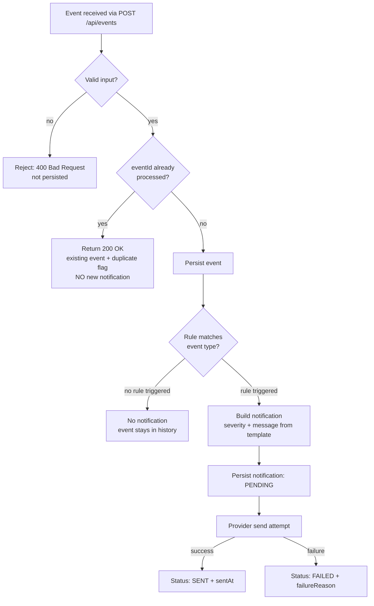

# Business Rules

> **Source of truth for all system behavior.** Specs, code, and tests must conform to this document. Any change here requires a PR that updates specs and tests in the same merge.

## 1. Event Types

| Type | Description | Value | Unit | Valid Range |
|---|---|---|---|---|
| `AIR_TEMPERATURE` | Ambient temperature | number | `C` | −20.0 … 60.0 |
| `AIR_HUMIDITY` | Relative air humidity | number | `%` | 0 … 100 |
| `SOIL_MOISTURE` | Soil moisture | number | `%` | 0 … 100 |
| `WATER_RESERVOIR_LEVEL` | Water reservoir level | number | `%` | 0 … 100 |
| `SILO_LEVEL` | Silo fill level | number | `%` | 0 … 100 |
| `EQUIPMENT_STATUS` | Equipment operational status | string enum | `null` | `OK` \| `FAILURE` \| `MAINTENANCE` |

New event types MAY be added later; each new type MUST define: value type, unit, valid range, and whether it has an associated rule.

## 2. Input Validation Rules

An event is **valid** only if **all** of the following hold. Invalid events are rejected with `400 Bad Request` and are **not** persisted.

| # | Rule |
|---|---|
| V1 | `eventId` — required, non-empty string |
| V2 | `farmId` — required, must reference an existing farm |
| V3 | `deviceId` — required, must reference an existing device **belonging to** `farmId` |
| V4 | `type` — required, must be one of the known event types |
| V5 | `value` — for the 5 sensor types: required number within the type's valid range |
| V6 | `value` — for `EQUIPMENT_STATUS`: required string, one of `OK` \| `FAILURE` \| `MAINTENANCE` |
| V7 | `unit` — required for sensor types and MUST match the type's unit (`C` or `%`); MUST be `null` for `EQUIPMENT_STATUS` |
| V8 | `timestamp` — required, valid ISO 8601 string with timezone offset |

Examples of invalid input: missing `eventId`; unknown `type`; `AIR_HUMIDITY` of `130` (out of range); `AIR_TEMPERATURE` with unit `%` (unit mismatch); unparseable `timestamp`.

## 3. Notification Rules

Each rule is identified by a stable **rule ID** (stored as `Notification.ruleTriggered`).

| Rule ID | Event Type | Condition | Severity | Message Template |
|---|---|---|---|---|
| `AIR_TEMPERATURE_HIGH` | `AIR_TEMPERATURE` | `value > 35` | `WARNING` | `⚠️ Temperature alert: {value}°C recorded by sensor {deviceId} at {farmName}.` |
| `AIR_HUMIDITY_LOW` | `AIR_HUMIDITY` | `value < 30` | `INFO` | `⚠️ Low humidity alert: air humidity reached {value}% at {farmName}.` |
| `SOIL_MOISTURE_LOW` | `SOIL_MOISTURE` | `value < 20` | `INFO` | `💧 Irrigation alert: soil moisture is at {value}%. Check irrigation needs.` |
| `WATER_RESERVOIR_LOW` | `WATER_RESERVOIR_LEVEL` | `value < 15` | `WARNING` | `💧 Low water level: the reservoir is at only {value}% of capacity.` |
| `SILO_LEVEL_LOW` | `SILO_LEVEL` | `value < 15` | `WARNING` | `⚠️ Low silo level: the silo monitored by {deviceId} is at {value}% of capacity.` |
| `EQUIPMENT_FAILURE` | `EQUIPMENT_STATUS` | `value = FAILURE` | `CRITICAL` | `🚨 Equipment failure: a failure was detected on equipment {deviceId}.` |

Template placeholders: `{value}` (formatted with `.` decimal separator, e.g. `38.5`), `{deviceId}`, `{farmName}`.

### Severity Classification Rationale

| Severity | Meaning | Rules |
|---|---|---|
| `CRITICAL` | Immediate action required; operational failure | `EQUIPMENT_FAILURE` |
| `WARNING` | Resource at risk; attention needed soon | `AIR_TEMPERATURE_HIGH`, `WATER_RESERVOIR_LOW`, `SILO_LEVEL_LOW` |
| `INFO` | Advisory / monitoring condition | `AIR_HUMIDITY_LOW`, `SOIL_MOISTURE_LOW` |

## 4. Boundary Semantics

All threshold comparisons are **strict**. A value exactly at the threshold does **not** trigger.

| Event Type | Value | Outcome |
|---|---|---|
| `AIR_TEMPERATURE` | 35.0 | ✅ no alert (must be **>** 35) |
| `AIR_TEMPERATURE` | 35.1 | 🚨 alert |
| `AIR_HUMIDITY` | 30.0 | ✅ no alert (must be **<** 30) |
| `AIR_HUMIDITY` | 29.9 | 🚨 alert |
| `SOIL_MOISTURE` | 20.0 | ✅ no alert |
| `WATER_RESERVOIR_LEVEL` | 15.0 | ✅ no alert |
| `SILO_LEVEL` | 15.0 | ✅ no alert |
| `EQUIPMENT_STATUS` | `OK` / `MAINTENANCE` | ✅ no alert (only `FAILURE` triggers) |

## 5. Normal Events

Events whose values do not trigger any rule are **valid and MUST be persisted** — they are part of the farm's history — but produce **no notification**.

## 6. Cardinality

- One event triggers **at most one notification** (each event has a single type, and at most one rule matches per type).
- `Notification.eventId` is unique — enforced at the database level.

## 7. Idempotency

IoT systems may re-deliver the same reading. The system MUST:

1. Detect re-delivery by `eventId` (primary key of `Event`).
2. Return `200 OK` with the **existing** stored event (plus a `duplicate: true` flag) — not an error.
3. **Never** generate a second notification for an already-processed `eventId`.

## 8. Notification Delivery

1. Every generated notification is persisted with status `PENDING`.
2. The active `NotificationProvider` (MVP: `MockWhatsAppProvider`) is called for each notification.
3. On success → status `SENT` + `sentAt` timestamp. On failure → status `FAILED` + `failureReason`.
4. A failed send does **not** roll back the notification — the failure is recorded and visible in the history.

## 9. Rule Evaluation Flow

## 10. Demo Dataset

The seed/demo data (from the assignment) consists of 7 events: the first 6 trigger each of the 6 rules; the 7th (`AIR_TEMPERATURE` = 27) is a normal reading that triggers nothing. See [`scenarios.md`](scenarios.md) and `Instructions.md` §13.
