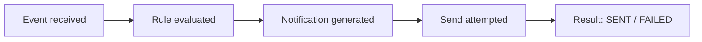

# Business Scenarios

Canonical scenarios the system must handle. These drive the test strategy ([`../architecture/`](../architecture/) and specs) — every scenario here MUST be covered by automated tests.

## Scenario Index

| # | Scenario | Category | Spec |
|---|---|---|---|
| S1 | Normal reading (no alert) | Core | SPEC-001, SPEC-002 |
| S2–S7 | Each of the 6 alert types | Core | SPEC-002 |
| S8 | Boundary values (at threshold) | Edge | SPEC-002 |
| S9–S15 | Invalid inputs (7 variants) | Edge | SPEC-001 |
| S16 | Duplicate event (idempotency) | Edge | SPEC-001 |
| S17 | Notification send failure | Edge | SPEC-003 |
| S18 | History persistence and traceability | Core | SPEC-007 |

## S1 — Normal Reading

- **Given** the system is running with seeded farm/devices
- **When** `POST /api/events` receives `AIR_TEMPERATURE = 27.0` (unit `C`)
- **Then** respond `201 Created`, the event is persisted, **no notification is generated**

## S2–S7 — The Six Alerts

| # | Input | Rule Triggered | Severity | Notification Contains |
|---|---|---|---|---|
| S2 | `AIR_TEMPERATURE = 38.5` | `AIR_TEMPERATURE_HIGH` | WARNING | `⚠️ Temperature alert: 38.5°C recorded by sensor sensor-temp-01 at Fazenda Boa Esperança.` |
| S3 | `AIR_HUMIDITY = 24` | `AIR_HUMIDITY_LOW` | INFO | `⚠️ Low humidity alert: air humidity reached 24% at Fazenda Boa Esperança.` |
| S4 | `SOIL_MOISTURE = 17` | `SOIL_MOISTURE_LOW` | INFO | `💧 Irrigation alert: soil moisture is at 17%. Check irrigation needs.` |
| S5 | `WATER_RESERVOIR_LEVEL = 12` | `WATER_RESERVOIR_LOW` | WARNING | `💧 Low water level: the reservoir is at only 12% of capacity.` |
| S6 | `SILO_LEVEL = 10` | `SILO_LEVEL_LOW` | WARNING | `⚠️ Low silo level: the silo monitored by silo-sensor-01 is at 10% of capacity.` |
| S7 | `EQUIPMENT_STATUS = FAILURE` | `EQUIPMENT_FAILURE` | CRITICAL | `🚨 Equipment failure: a failure was detected on equipment irrigation-pump-01.` |

Each: **Given** seeded data → **When** the event is posted → **Then** `201`, event persisted, exactly one notification with the rule, severity, and message above, status becomes `SENT` (MVP mock provider).

## S8 — Boundary Values

- **Given** any sensor type with a threshold rule
- **When** the value is **exactly** at the threshold (35.0, 30.0, 20.0, 15.0, 15.0)
- **Then** the event is valid and persisted, but **no notification** is generated (strict comparisons — see [`business-rules.md` §4](business-rules.md#4-boundary-semantics))

## S9–S15 — Invalid Inputs

| # | Input | Expected |
|---|---|---|
| S9 | Missing `eventId` | `400`, not persisted |
| S10 | Unknown `deviceId` (or device from another farm) | `400`, not persisted |
| S11 | Unknown `type` (e.g. `WIND_SPEED`) | `400`, not persisted |
| S12 | `AIR_HUMIDITY = 130` (out of range) | `400`, not persisted |
| S13 | `AIR_TEMPERATURE` with `unit: "%"` (unit mismatch) | `400`, not persisted |
| S14 | `timestamp: "not-a-date"` | `400`, not persisted |
| S15 | `EQUIPMENT_STATUS` with numeric `value: 42` | `400`, not persisted |

Error responses MUST identify which field(s) failed and why (see [`../architecture/api.md`](../architecture/api.md#error-responses)).

## S16 — Duplicate Event

- **Given** event `event-100` was already processed (and generated a notification)
- **When** the identical event is posted again
- **Then** respond `200 OK` with the stored event and `duplicate: true`; **no** new notification; notification count for `event-100` remains 1

## S17 — Notification Send Failure

- **Given** the provider is configured to fail (e.g. failure injection in tests)
- **When** an event triggers a rule
- **Then** the notification is persisted with status `FAILED` and a `failureReason`; the event remains processed; the pipeline does not crash

## S18 — History & Traceability

- **Given** a mix of processed events (alerting and normal)
- **When** the history is queried (API or UI)
- **Then** for each event one can see: which event was received, when, from which device, whether a rule triggered, which message was produced, whether a send was attempted, and its result — the full chain:

## UI Scenarios (summary)

- **Dashboard** (SPEC-005): farm info, devices, latest events and notifications with severity/status, auto-refresh.
- **Simulator** (SPEC-006): compose and submit events; feedback distinguishes *alert generated* / *no alert* / *duplicate* / *invalid*.
- **History** (SPEC-007): filterable, paginated table relating events and notifications.
