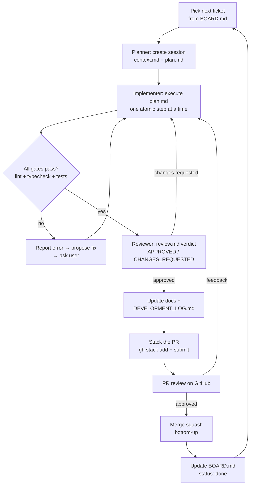

# Workflow — Development Loop

How every change is made in this project. **Read this before writing any code.**

## Principles

1. **Spec-driven.** `docs/` is the source of truth. Code conforms to specs; specs change through PRs, never silently.
2. **Small, reviewable PRs.** Tickets are capped at **5 points**; one ticket = one PR = one squash commit on `main`.
3. **Planner → Implementer → Reviewer.** Expensive model plans, cheap model implements, expensive model reviews (see `.claude/skills/planner-implementer-workflow/SKILL.md`).
4. **Stop on ambiguity.** If docs are unclear or conflict, STOP and ask the user. Never guess.
5. **No auto-fix on failure.** On test/build errors: report, propose a fix, get approval, then fix.

## The Loop



## Step by Step

### 1. Pick a ticket

- Source of truth: [`tickets/BOARD.md`](tickets/BOARD.md) — take the first `todo` ticket whose dependencies are all `done`.
- Read the ticket file: `tickets/EPIC-NN-slug/T-NNN-slug.md`.
- Set the ticket status to `in-progress` on the BOARD (commit this change with your first stack layer or as part of the ticket PR).### 2. Plan (Planner — expensive model)

Create a session folder:

```
.tmp/sessions/{YYYY-MM-DD}-{ticket-slug}/
  context.md          # discovery: standards, references, spec links
  plan.md             # the contract: files to touch, atomic steps, acceptance criteria
  implementation.md   # implementer log (decisions, deviations)
  review.md           # reviewer verdict
```

`plan.md` rules (from the skill — enforce them):

- Atomic, mechanical steps — each with a done-when criterion.
- Absolute paths; reference existing files as patterns instead of describing patterns.
- Explicit anti-patterns ("do NOT ...").
- Acceptance criteria copied from the ticket + spec.

### 3. Implement (Implementer — cheap model)

- Read `context.md` and `plan.md` first. Execute steps **literally, one at a time**.
- Validate after every step: `pnpm lint`, `pnpm typecheck`, `pnpm test` (scoped to the affected package when sensible).
- Log deviations in `implementation.md`.
- **Stop** on ambiguity or error. Do not improvise.

### 4. Review (Reviewer — expensive model)

- Reads `plan.md` + `implementation.md` + `git diff`; runs the full gates.
- Checks every acceptance criterion from the ticket.
- Writes `review.md`: `APPROVED` or `CHANGES_REQUESTED` with reasons.
- Optionally run the review skills: `code-review-subagent`, `review-bugbot`, `review-security`.

### 5. Ship

- Update any docs affected by the change (same PR).
- Append a `DEVELOPMENT_LOG.md` entry (see below).
- Create the PR **on the fork**: `gh pr create ... --repo jvpg5/NotificationHub` (never on the original repo) — see [`pr-stacking.md` § Fork Workflow](pr-stacking.md#fork-workflow-where-prs-live).
- Stack the PR: [`pr-stacking.md`](pr-stacking.md).
- After merge: update BOARD status to `done`, sync remaining stacks (`gh stack sync`).

## Definition of Done (per ticket)

- [ ] All acceptance criteria met and covered by tests
- [ ] `pnpm lint`, `pnpm typecheck`, `pnpm test` pass
- [ ] Reviewer verdict: APPROVED
- [ ] Docs updated if behavior changed
- [ ] `DEVELOPMENT_LOG.md` entry added
- [ ] PR merged (squash) and BOARD updated

## DEVELOPMENT_LOG.md (project requirement)

Every ticket adds one entry recording: what was done, key decisions, AI interactions (tool, objective, prompt summary, decision taken — accepted/partially/rejected), and any deviations from the plan. Required by `Instructions.md` §16.

## Parallel Work

Multiple tickets can be developed simultaneously using **independent stacks** — see [Parallel Stacks](pr-stacking.md#parallel-stacks-working-on-multiple-tickets-at-once). Only attempt this when both tickets are marked `parallel-safe` and touch disjoint areas (e.g. one backend + one frontend).

## Autonomous Pipeline (`/ticket`)

The loop above can run without supervision via the opencode agents defined in `.opencode/agent/`:

| Role | Agent | Model | Does |
|---|---|---|---|
| Orchestrator/Planner | `orchestrator` | GLM-5.3 | Selects the ticket, writes `context.md` + `plan.md`, delegates, reports |
| Implementer | `implementer` | DeepSeek v4 Flash | Executes `plan.md` literally: branch, code, gates, commits, PR |
| Reviewer | `reviewer` | DeepSeek v4 Pro | Verifies criteria + gates, writes `review.md`, comments the verdict on the PR |

Usage: `/ticket next` (or `/ticket T-009`). One ticket per run — the pipeline stops after the review verdict is posted as a PR comment. **The user reviews and merges the PR on GitHub (squash)**; after merging, run `/ticket next` again (Phase 0 syncs the BOARD from merged PRs).

Guardrails: the implementer cannot merge, force-push, or push to `main`; the reviewer cannot edit code (only `.tmp/` session files and PR comments); the orchestrator cannot edit application code. Escalation conditions match the [Escalation](#escalation) list below — the pipeline stops and asks instead of guessing.

## Status Values (BOARD + tickets)

| Status | Meaning |
|---|---|
| `todo` | Not started |
| `in-progress` | Being implemented (session exists) |
| `in-review` | PR open on GitHub |
| `done` | Merged to `main` |
| `blocked` | Waiting on something — note why in the ticket |

## Escalation

Ask the user when:

- Specs/business rules are ambiguous or contradictory
- A change would break an existing acceptance criterion
- A ticket turns out larger than 5 points (split it first — propose the split)
- Any architectural decision not covered by [`../architecture/technical-decisions.md`](../architecture/technical-decisions.md)
