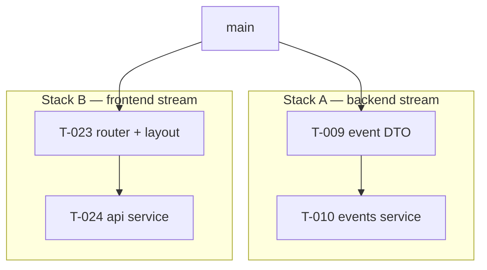

# Workflow — Stacked PRs (`gh stack`)

How this project uses GitHub Stacked PRs to keep development flowing without waiting on reviews.

## Model

- A **stack** is a linear chain of PRs rooted at `main`: `main ← PR1 ← PR2 ← ...`, each PR targeting the branch below it.
- **One ticket = one layer = one PR.** A ticket's PR contains only that ticket's changes (plus its doc/log updates).
- Stacks are **strictly linear** — GitHub does not support tree-shaped stacks (one PR with two children). Parallel work uses multiple independent stacks (below).
- Merges are **squash, bottom-up**: each merged ticket becomes exactly one clean commit on `main`. `gh stack` handles the `rebase --onto` mechanics automatically.

## Fork Workflow: Where PRs Live

This repository is a **fork**. Two remotes, two roles:

| Remote | Repository | Role |
|---|---|---|
| `origin` | `jvpg5/NotificationHub` | The fork. All branches, PRs, and squash merges happen here. |
| `upstream` | `cogito-lab/NotificationHub` | The original. Reference only: never a push or PR target. |

Rules:

1. **All PRs target the fork's `main`.** Never open a PR on the original repository.
2. **Every `gh pr` command must pass `--repo jvpg5/NotificationHub`** (`create`, `list`, `view`, `diff`, `comment`). Reason: when `--repo` is omitted, the gh CLI resolves the PR repository by preferring the remote named `upstream`, so commands silently land on the original repo. This happened during T-001: the PR was opened on `cogito-lab/NotificationHub` by mistake, closed, and recreated on the fork.
3. **Branches are pushed only to `origin`** (the fork). Never push to `upstream`.
4. When re-cloning this project, either name the original's remote anything other than `upstream` (e.g. `cogito-lab`) so gh's default resolution picks the fork, or follow rule 2 strictly.
5. `gh stack` operations act on `origin` (the fork). Single-layer stacks need no `gh stack link`; multi-layer stacks are pushed and registered with `gh stack submit`.

## Setup (once per machine)

```bash
gh extension install github/gh-stack   # requires gh CLI v2.0+
gh auth login                          # if not already authenticated
```

## Conventions

| Item | Convention |
|---|---|
| Branch name | `T-NNN-slug` (e.g. `T-009-create-event-dto-validation`) |
| PR title | `T-NNN: Ticket title` (e.g. `T-009: CreateEventDto + input validation`) |
| PR description | Follow `.claude/skills/pr-description/SKILL.md`; link the ticket file and spec |
| Commits | Conventional commits (`feat:`, `fix:`, `test:`, `docs:`, `chore:`, `refactor:`) |
| Merge method | Squash |
| PR target repo | The fork: `origin` = `jvpg5/NotificationHub`. Never the original (`upstream`). See [Fork Workflow](#fork-workflow-where-prs-live) |
| History | Linear — required by stacked PRs; no merge commits on stack branches |

## Stack Lifecycle (single stack)

```bash
# Start a stack for your first ticket (from main)
git checkout main && git pull
gh stack init T-009-create-event-dto-validation
# ... implement, commit ...

# Add the next ticket on top (while T-009 is still in review)
gh stack add T-010-events-service-controller
# ... implement, commit ...

# Push branches, create PRs, link them as a stack on GitHub
gh stack submit

# Inspect
gh stack view

# After reviews pass: merge bottom-up (squash)
gh stack merge --squash

# Keep remaining branches current after any merge
gh stack sync
```

### Cheat Sheet

| Command | When |
|---|---|
| `gh stack init <branch>` | Starting a new stack from `main` |
| `gh stack add <branch>` | Adding the next ticket on top of the current stack |
| `gh stack submit` | Pushing + creating/updating PRs and the stack |
| `gh stack view` | Seeing the stack, PR links, and merge state |
| `gh stack sync` | After any merge: fetch, rebase cascade, push, update PRs |
| `gh stack rebase` | Manually rebasing the stack (e.g. after conflicts) |
| `gh stack merge --squash` | Merging reviewed PRs bottom-up |
| `gh stack up` / `down` / `top` / `bottom` | Navigating between layers |
| `gh stack checkout <stack\|pr\|branch>` | Switching to another stack |
| `gh stack modify` | Restructuring (reorder/drop/fold/insert layers) |

## Parallel Stacks: Working on Multiple Tickets at Once

GitHub stacks cannot branch (no subtrees), but **multiple independent stacks can coexist in the same repository**, each rooted at `main`. This is the project's parallelism pattern:



**When allowed** — all must hold:

1. Both tickets are marked `parallel-safe` on the BOARD.
2. The tickets touch **disjoint areas** (typically: one backend epic + one frontend epic).
3. Each stream is developed in its own stack, created from an up-to-date `main`.

**How**:

```bash
# Stream A (e.g. backend ticket)
git checkout main && git pull
gh stack init T-009-create-event-dto-validation

# Stream B (e.g. frontend ticket) — separate worktree/terminal
git checkout main
gh stack init T-023-router-layout
```

**Rules**:

- Merge stacks one at a time; after each merge run `gh stack sync` in the other stack to rebase it onto the updated `main`.
- If both streams end up touching the same file, stop one stream and serialize — do not resolve the conflict twice.
- Keep at most **2 concurrent stacks** (one backend + one frontend) to stay reviewable.

## CI Notes

- Every PR in a stack is evaluated by GitHub Actions **as if it targeted `main`** — checks run per PR, so keep each layer green independently.
- All PRs below a given PR must be passing before that PR can merge.
- Squash merges rewrite commits; never `git push --force` stack branches manually — use `gh stack push` / `gh stack sync` (they use `--force-with-lease` correctly).

## Anti-patterns

- ❌ Creating a PR targeting `main` directly for a branch that sits on top of unmerged work (breaks the chain).
- ❌ Mixing two tickets in one layer/PR.
- ❌ Manual force-pushes to stack branches.
- ❌ Starting a parallel stack for tickets that share files with an open stack.
- ❌ Letting a stack grow beyond ~4 unmerged layers — merge or prune before stacking more (review debt compounds).
